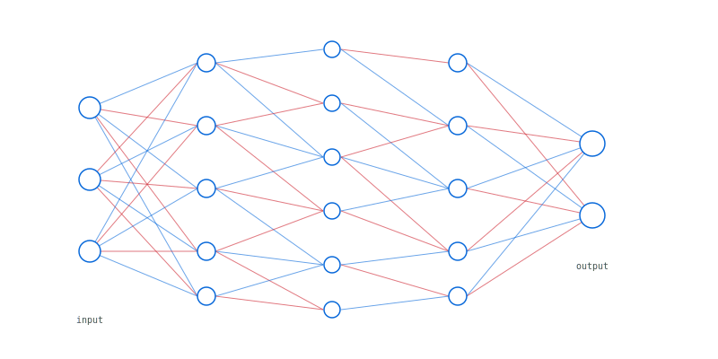
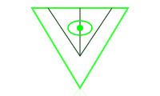

### Hello, my name is Maykon Adriell.
**Systems Architect · Machine Learning Engineer · Creative Coder**

I build **AI-powered products** and **backend systems** focused on real value and stable production:
 
• **Observability** (metrics, logs, traces)
 
• **Reproducibility** (pipelines, experiments, evaluations)
 
• **Automation** (CI/CD, infrastructure as code)
 

My background spans full-cycle developer, technical leadership, and applied research.

> *This profile reflects my triple passion: AI, generative art/experimental code, and complex systems science. The visuals below are an algorithmic expression of this philosophy.*

 

  

*Nihil verum est; omnia licent*

---

 

> *"Curiouser and curiouser..."*  
> *"It's no use going back to yesterday — I was a different person then."*  
> *"I give myself very good advice, but I very seldom follow it."*

 

  

 

$$
\frac{d\Psi}{dt} = \underbrace{-\Lambda[\Sigma, \Psi]}_{\text{compression}} + \underbrace{\mathcal{L}_{\Delta}(\Psi)}_{\text{emergence}}
$$

*Min(Σ) → Max(Δ)*

 

$$
\begin{cases} 
\text{Invariants} \gg \text{Opinion} \\
\text{Limits} \supset \text{Promises} \\
\displaystyle\lim_{t \to \infty} K(\text{code}) \to \emptyset
\end{cases}
$$

---

 

  <!-- 1. Cloud, Infra & CI/CD (Base) - 100% -->
  

    <b>Cloud, Infra & CI/CD</b>
      
    
    
    
    
  

  <!-- 2. AI & Data Science - 85% -->
  

    <b>AI & Data Science</b>
      
    
    
    
    
  

  <!-- 3. Languages - 70% -->
  

    <b>Languages</b>
      
    
    
    
    
  

  <!-- 4. Platforms & Environments - 55% -->
  

    <b>Platforms & Environments</b>
      
    
    
  

  <!-- 5. Tools & Creativity (Tip) - 40% -->
  

    <b>Tools & Creativity</b>
      
    
    
  

   

  

 

<b>◉ Metrics</b>

 

---

<picture>
  <source media="(prefers-color-scheme: dark)" srcset="https://raw.githubusercontent.com/MaykonAdriell/MaykonAdriell/output/github-snake-dark.svg?palette=github-dark&color_snake=#00d4ff&color_dots=#161b22,#0d1117,#003820,#00602d,#26a641" />
  <source media="(prefers-color-scheme: light)" srcset="https://raw.githubusercontent.com/MaykonAdriell/MaykonAdriell/output/github-snake.svg" />
  
</picture>

---

[educai-gyn](https://github.com/Omniamind-org/educai-gyn) · [data-science-gitflow](https://github.com/MaykonAdriell/Data_science_git-flow_proposal_-ex1-)

 

  
   
  <a href="https://maykonadriell.github.io/MaykonAdriell/" style="text-decoration:none; color:#181818;">01110100 01101111 01100011 01100001 00100000 01100100 01101111 00100000 01100011 01101111 01100101 01101100 01101000 01101111</a>

